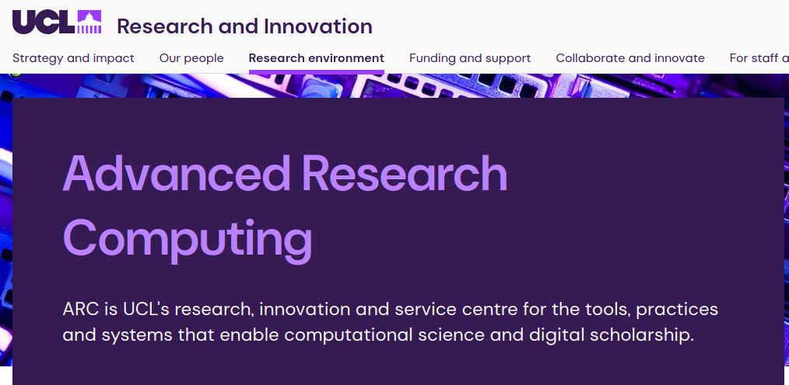
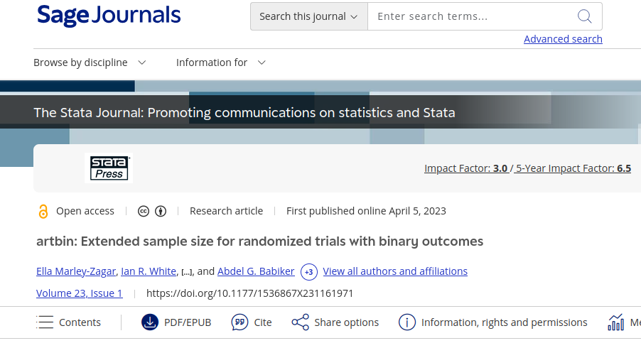

## Today's Talk

 - Brief Introduction (UCL ICTU, UCL ARC)
 - Code Translation Motivation
 - Code Translation Mechanics
 - Workshop Results and Next Steps

## Innovative Clinical Trials Unit

{fig-alt="A screenshot of the Innovative Clinical Trials Unit website" height="280"}

 - World leaders in clinical trial design.
 - Robust/tested statistics to support clinical trial design.
 - Impact through successful clinical trials.


## Advanced Research Computing

{fig-alt="A screenshot of the Advanced Research Computing website, stating that ARC is UCL's research, innovation and service centre for the tools, practices and systems that enable computational science and digital scholarship." height="280"}

 - Support researchers to create impact through software.
 - Software re-use and software sustainability.
   - Software that outlives the original grant funding.
 - Develop skills to contribute to key open source software.

## Motivation - Stata Translation

 - Maximise impact of software development.
 
## Example artbin - Sample size calculator for randomized trials.

{fig-alt="A screenshot of the artbin publication in the Stata Journal titled artbin: Extended sample size for randomized trials with binary outcomes." " height="280"}

  - Published in Stata journal
  - High quality software (including documentation and tests)
  - Open source (GPL3) - anyone with a Stata license can download/use/modify artbin.
  - Demonstrable impact - currently cited in 4 trial based studies.
  - But can we increase impact by widening access?

## Motivation Stata and R (Software Metrics)

 - R is free and open source. 
 - Many more users and developers for R.
 - Stata Language on GitHub 18.4K repositories ~ median 6 stars 
   - High impact Stata packages reghdfe 248 stars, ietoolkit 244
 - R Language on GithHub 1.1M repositories ~ median 313 stars 
 
## Motivation Stata and R - Creating Impact

 - Conclusion. Translations;
   - Likely to increase impact of software, but we can't be certain yet.

## Stata2R: Practicalities

 - Pre-requisites:  
   - Well written/documented/tested Stata code 👍
   - Language Expertise (Stata and R)
   - Domain Expertise (Statistics)
   - Time (funding)

 - Can we leverage advances in agent based code translation?

## Rapidly growing work on code translation using language models.

{fig-alt="A plot showing a rapid increase in pubications references Lanugage models and code translations (to 65 in 2025)" width="65%"}

## Stata2R: Practicalities

 - Resources:
   - Departmental subscription to Claude Code.
   - Approx 4 weeks RSE time.
 - Plan:
   - Research Code translation. 
   - Develop method -> A Claude Plugin.
   - Develop HowTo for Statisticians.

## Agentic Coding (Claude Code)
 
 - A user interface for working with large language models to complete software tasks. 
 - Users communicate in plain text (for example "translate artbin to R")
 - Non deterministic (stochastic sampling from many possible answers).
 - Supports extension with "Skills" and "Plugins"
 - We wrote a Stata2R plugin with 4 skills to try and limit the effects of non deterministic behaviour.

## Plugin Contents 2: Translation Strategy
 
 - Summarise the purpose of the library.
 - Is it worth translating? (existing R libraries, users etc)
 - Is the documentation and testing sufficient to enable a good translation.
 
## Plugin Contents 2: Stata to Pseudocode
 
 - Evidence that two stage translation creates better code.
 - Enables a human review step.
 - Supports translation to multiple target language. 
 - Deliberately excluded any existing tests.
 
## Plugin Contents 3: Pseudocode to R
 
 - Use the pseudocode to create an R package.

## Plugin Contents 4: Add Stata Tests to R
 
 - Port the Stata tests to R and confirm they pass (verification step)
 - Port Stata documentation and examples to R (create vignettes)
 - Copy over licence file and create README, CONTRIBUTING, files etc.
 
## What's in a Skill

[Skills are Plain Text](https://github.com/stata-translations/Stata2R/blob/main/stata-translation/skills/)

 - Plugins are easy to install

    ```
    /plugins marketplace add https://github.com/stata-translations/Stata2R.git
    /plugin install stata-translation
    /reload-plugins
    /stata-translation:hello
    ```

## Run as an interactive workshop

Developed and delivered a [Workshop](https://github.com/stata-translations/Stata2R/blob/main/docs/workshop.md) to  
10 statisticians. Aims:

  - Teach statisticians to use Claude to translate code.
  - Leverage statisticians skills to help understand how well Claude works.
    - [Pre Workshop Surveys](https://forms.cloud.microsoft/Pages/ResponsePage.aspx?id=_oivH5ipW0yTySEKEdmlwuNcJ7ofdGhDpRexUha3NYhUMU5QQ000NVpFTVRKRTEzRDRCQ0w4V05XMS4u)
    - [Post work shop survey](https://forms.office.com/Pages/ResponsePage.aspx?id=_oivH5ipW0yTySEKEdmlwkgtFALcEfRKnhSRePBd-9dUQjI1SzdIT1pROVBHVDJSNDU3QUNZVTBGTiQlQCN0PWcu)

## Results: Brief

  - Claude can translate code and appears to give sensible results.
  - Participants were generally happy and eager to pursue this further.
    - Statisticians take the accuracy of the software very seriously. 

## Pre-Workshop: Stata and R Fluency

```{=html}
<iframe width="100%" height="100%" src="https://stata-translations.github.io/workshop-results/pre-stata-vs-r_fluency.html" title="X-Y plot of Stata vs R Fluency. No one was fluent in both."></iframe>
```

## Pre-Workshop: Expectations Word Cloud

```{=html}
<iframe width="100%" height="100%" src="https://stata-translations.github.io/workshop-results/pre_expectations.html" title="A word cloud of answers to the free text question 'Is there anything specific you want to get out of the workshop?' The dominant phrase is 'Stata to R Translation' Other phrases include 'LLM Workflow best practices' and 'Exploring Claude's Capabilities'"></iframe>
```

## Post-Workshop: Concerns Work Cloud


```{=html}
<iframe width="100%" height="100%" src="https://stata-translations.github.io/workshop-results/post_concerns_wordcloud.html" title="A word cloud of answers to the post workshop question 'What concerns (if any) do you have with using large language models for code translation? Notabale answers include 'Fear of hidden errors' and 'Testing and output control'"></iframe>
```

## Post-Workshop: Ideas for Improvements / Future Work.

```{=html}
<iframe width="100%" height="100%" src="https://stata-translations.github.io/workshop-results/post_improvements.html" title="A word cloud of answers to the question "What improvements would you suggest? Most respondonts wanted to see more work on 'verifying correctness'"></iframe>
```

## Post-Workshop: Skills assessment (interaction required).

```{=html}
<iframe width="100%" height="100%" src="https://stata-translations.github.io/workshop-results/post_model_interaction.html" title="The third blood vessel game."></iframe>
```

## Post-Workshop: Skills assessment (reliability).

```{=html}
<iframe width="100%" height="100%" src="https://stata-translations.github.io/workshop-results/post_model_reliability.html" title="The third blood vessel game."></iframe>
```

## Post-Workshop: Skills assessment (Time Taken).

```{=html}
<iframe width="100%" height="100%" src="https://stata-translations.github.io/workshop-results/post_model_time.html" title="The third blood vessel game."></iframe>
```

## Further Considerations

  - Ongoing development (do you plan on maintaining both versions?)
  - Who owns the copyright?
  - Are you complying with the original license.
  - Preventing access to sensitive data.

## Summary

  - Claude can translate code.
  - The plugin provides some structure, but human intervention is still required to keep Claude on track.
  - Translation depends on documentation and testing as well as source code quality.
  - Results are non deterministic.

## Contributors:

  Asif Tamuri, James Carpenter, Matthew Burnell, David Fisher, Babak Choodri-Oskooei, Matteo Quartagno, Becky Turner, Tra My Pham, Guilio Scola, Michelle Clements, Ian White, Samina Begum, Henry Bern, Akshay Jagadeesh, David Perez-Suarez, Haroon Chughtai, and Toby Thompson.
